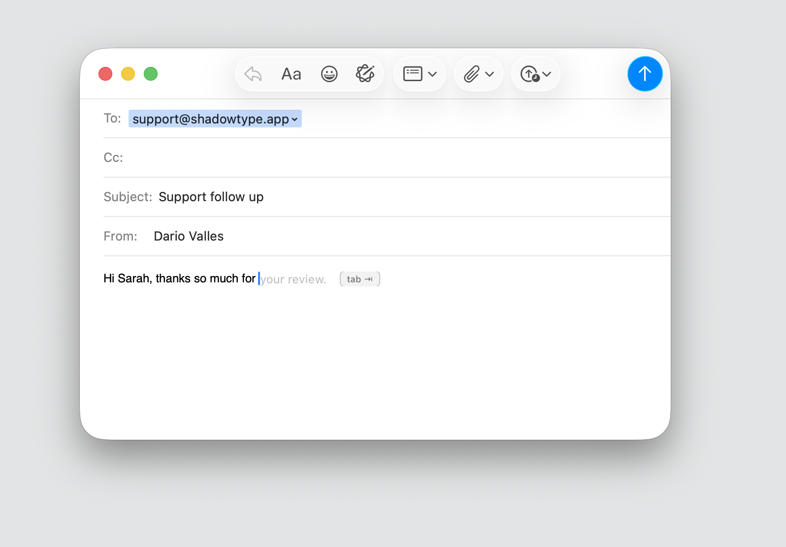

<div align="center">


# Shadowtype

### Private, on-device AI autocomplete for macOS

Ghost-text completion in **any** text field — Mail, Slack, Notes, your browser, your editor.
Runs a local LLM on Apple Silicon. **Nothing ever leaves your machine.** Pay once, own it forever.

[](https://shadowtype.app/download)
[](https://github.com/dario-valles/shadowtype-mac/releases)
[](https://github.com/dario-valles/shadowtype-mac/stargazers)

**[shadowtype.app](https://shadowtype.app)** · [Download](https://shadowtype.app/download) · [FAQ](docs/FAQ.md) · [Install](docs/INSTALL.md) · [Report a bug](https://github.com/dario-valles/shadowtype-mac/issues/new/choose)

<br/>



</div>

---

> **What this repo is:** the home for Shadowtype's **releases, docs, and issue tracker**.
> Shadowtype is a proprietary one-time-purchase app — the app source is not in this repo.
> Use **Issues** to report bugs or request features, **Releases** to download, and **Discussions** to ask questions.

---

## What it does

Shadowtype predicts your next words as faint **ghost text** right at the caret, in any text field on your Mac. Press <kbd>Tab</kbd> (or <kbd>→</kbd>) to accept. It runs a real LLM **locally** on Apple Silicon — so it works offline, needs no account, and your keystrokes never touch the cloud.

https://shadowtype.app — see the live demo on the homepage.

## Why Shadowtype

- **100% on-device & offline** — a local LLM via llama.cpp + Metal. No cloud call, ever. Block it at the firewall and it still works.
- **Pay once, own forever** — one-time license, no subscription.
- **Works everywhere you type** — system-wide, not locked to one app or Apple's surfaces.
- **No account, zero telemetry** — nothing to sign up for, nothing phoned home.
- **Inline ghost-text completion** — Tab / Right-Arrow to accept a word, ⌥Tab for a whole line.
- **Per-app & per-domain control** — turn it on/off per application or website.
- **Personalization that learns you** — locally, from your own writing.
- **Autocorrect & typo suppression** — quietly fixes as you go.
- **Multiple local models** — 10 free swappable models, or bring your own (BYOM).
- **Selection rewrite** — rewrite highlighted text in place, locally.
- **Local API + MCP** — a local HTTP API and MCP bridge for developers.
- **Multilingual** — emoji + multi-language with language steering.

~150 ms suggestions on an M2 with the compact model.

## Install

**Direct download** (recommended):

→ **[Download for macOS](https://shadowtype.app/download)** — Apple Silicon (M1+), macOS 14+.

**Homebrew** (community tap):

```sh
brew install --cask dario-valles/shadowtype/shadowtype
```

See **[docs/INSTALL.md](docs/INSTALL.md)** for tap setup and first-launch steps.

## Pricing

| | Free | Pro |
|---|---|---|
| System-wide ghost-text completion | ✅ | ✅ |
| Tab-to-accept | ✅ | ✅ |
| Fully local & offline | ✅ | ✅ |
| Accepted words / day | 100 | Unlimited |
| All models, rewrite, API/MCP, BYOM | — | ✅ |
| Price | Free forever | **$39 once** (Founders) · no subscription |

Try it free, no account. Upgrade once when you're ready — the license is yours for life.

## How it compares

| | Shadowtype | Cotypist | Cotabby | Apple Intelligence | Grammarly |
|---|---|---|---|---|---|
| Fully on-device | ✅ | ✅ | ✅ | ✅ | ❌ cloud |
| Works in any text field | ✅ | ⚠️ limited | ✅ | ⚠️ select apps | ⚠️ |
| One-time price | ✅ $39 | Free | Free (AGPL) | Free (built-in) | ❌ subscription |
| No account | ✅ | ✅ | ✅ | ✅ | ❌ |
| Bring your own model | ✅ | ❌ | ❌ | ❌ | ❌ |
| Local API + MCP | ✅ | ❌ | ❌ | ❌ | ❌ |

Full breakdowns: [vs Cotypist](https://shadowtype.app/shadowtype-vs-cotypist) · [vs Cotabby](https://shadowtype.app/shadowtype-vs-cotabby) · [vs Apple Intelligence](https://shadowtype.app/shadowtype-vs-apple-intelligence)

## Privacy

Shadowtype runs entirely on your Mac. No keystrokes, no text, no telemetry leave the device — verifiable: cut your network and it keeps working. See the [Privacy Policy](https://shadowtype.app/privacy).

## Support

- 🐛 **Bug?** [Open an issue](https://github.com/dario-valles/shadowtype-mac/issues/new/choose)
- 💡 **Feature idea?** [Request it](https://github.com/dario-valles/shadowtype-mac/issues/new/choose)
- 💬 **Question?** Check the [FAQ](docs/FAQ.md) or email **support@shadowtype.app**

## Stay in the loop

⭐ **Star this repo** to follow releases — Shadowtype ships often.

---

<div align="center">
<sub>Shadowtype is a proprietary application © 2026. This repository hosts releases, documentation, and the public issue tracker — it does not contain the application source code.</sub>
</div>
